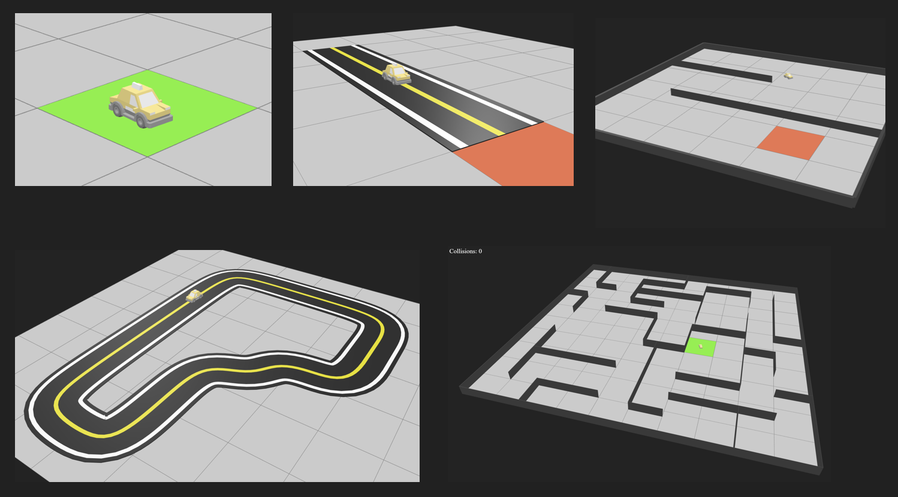
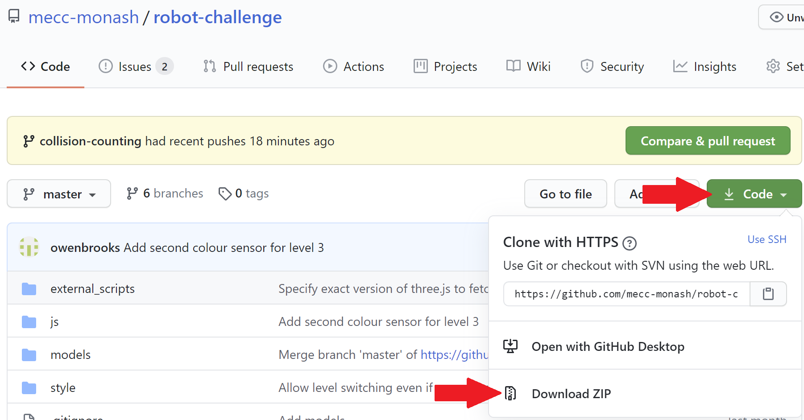

# Robot Challenge
A simulation to facilitate teaching the basics of robotics and microcontrollers. Topics covered include colour sensors, ultrasonic sensors, line-following and maze-solving.

# Setup
These setup instructions should work on Windows 10, macOS and many Linux distributions.
- Install [VSCode](https://code.visualstudio.com/download)
- Download the files from this repository and unzip:  

- Open the robot-challenge folder in VSCode (File -> Open Folder)
- Open the Extensions tab (Ctrl-Shift-X or Cmd-Shift-X) and install the Live Server extension
- Open the Explorer tab (Ctrl-Shift-E or Cmd-Shift-E) and right-click on index.html. 
- Click on 'Open with Live Server'
- Go to http://127.0.0.1:5500 in your browser (Chrome/Chromium-based browser will work best).

# User Guide & Controls
- Press 'p' to pause/unpause and select level
- Press 'r' to restart the level
- Press 'c' to switch between third person view or free cam
- Use the arrow keys, wasd or ijkl to control the car manually.
- Add code to control the car autonomously inside the `js/Micro.js` file.

# ThreeJS Resources
The three.js library was used to create the simulation environment, so if you're interested in creating something similar or modifying this code, check out these resources:

The [three.js examples page](https://threejs.org/examples/) has examples covering a wide range of features in three.js so it's always a great first place to look.

There's also a [useful links page](https://threejs.org/docs/#manual/en/introduction/Useful-links).
